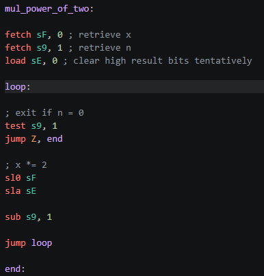

# PicoBlaze Assembly Extension for VSCode

This extension provides syntax highlighting and general language features for PicoBlaze Assembly 3 & 6 in Visual Studio Code. For a Language Reference see [OpenPicoBlaze Assembler](https://kevinpt.github.io/opbasm/rst/language.html).

It does so by contributing a new language called `psm` / `pbasm` which is automatically selected for `.psm` files.

